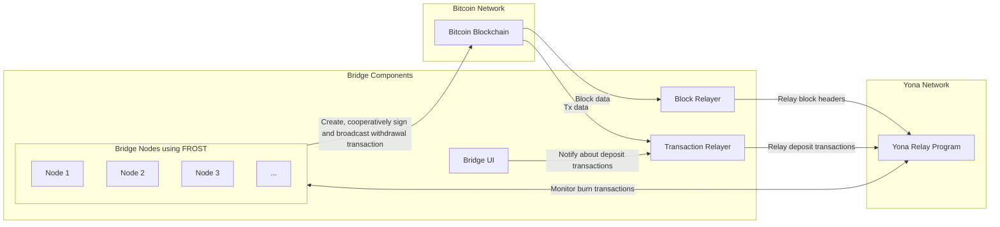

# Yona Canonical Bridge

This repository contains the implementation of the Yona Canonical Bridge, a secure and efficient solution for
cross-chain transactions between the Bitcoin and Yona networks. The bridge facilitates seamless asset transfers to Yona
L2, broadening Bitcoin's use cases by introducing a programmable layer powered by Solana's high-performance
virtual machine.

## Repository Structure

The repository contains the following components:

- [BTC relay on-chain program](programs/btc-relay)
- [Off-chain Block relayer](block_relayer)
- [Faucet for custom Bitcoin testnet](btc_faucet)

## Bridge architecture



## Dev environment configuration

1. Install Rust and Docker.
2. Install Solana CLI: https://docs.solanalabs.com/cli/install
3. Install Anchor: https://www.anchor-lang.com/docs/installation and select version `0.30.1`:

```bash
avm install 0.30.1
avm use 0.30.1
```

4. Generate a new keypair: `solana-keygen new --no-bip39-passphrase -s -o anchor.json`.
5. Install yarn.
6. Run `yarn` at the project root.
7. Run `anchor test` to test BTC relay program.
8. Run `anchor build && cd block_relayer && cargo test` to start E2E tests of all bridge components.