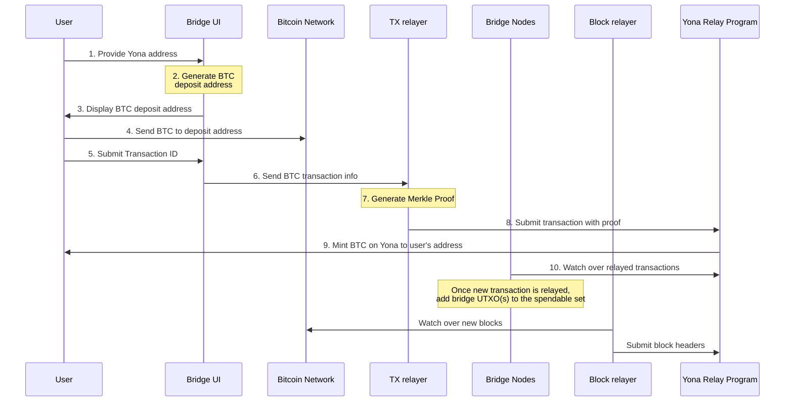

# Diagram description

1. Provide Yona address: The user initiates the bridging process by providing their Yona address to the Bridge UI.
   This is the address where they want to receive the bridged BTC on the Yona network.
2. Generate BTC deposit address: The Bridge UI generates a unique Bitcoin deposit address, which is linked to the user's
   Yona address in the bridge's system. Importantly, the generated address is of the P2WSH (Pay-to-Witness-Script-Hash)
   type, which is supported by the majority of Bitcoin wallets out of the box. This ensures broad compatibility and ease
   of use for most users without requiring special wallet configurations.
3. Display BTC deposit address: The Bridge UI shows the generated Bitcoin address to the user. This is the address where
   the user needs to send their Bitcoin for bridging.
4. Send BTC to deposit address: The user transfers the desired amount of Bitcoin from their wallet to the provided
   deposit address on the Bitcoin network.
5. Submit Transaction ID: After sending the Bitcoin, the user submits the Bitcoin transaction ID to the Bridge UI. This
   allows the bridge to track and verify the transaction.
6. Send BTC transaction info: The Bridge UI forwards the Bitcoin transaction information to the TX relayer for
   processing and verification.
7. Generate Merkle Proof: The TX relayer creates a cryptographic Merkle proof that demonstrates the transaction's
   inclusion in the Bitcoin blockchain. This proof is crucial for verifying the transaction on the Yona side.
8. Submit transaction with proof: The TX relayer sends the transaction details along with the Merkle proof to the
   Relay Program. This program is responsible for verifying and processing the bridged transaction on the Yona network.
9. Mint BTC on Yona to user's address: Once the Yona Relay Program verifies the transaction and proof, it mints an
   equivalent amount of BTC on the Yona network and sends it to the user's specified Yona address.
10. Watch over relayed transactions: Bridge Nodes continuously monitor transactions relayed to the Yona Relay Program.
    Once a new bridging transaction is finalized, Bridge Nodes add corresponding UTXO(s) to their spendable set, which
    means that they are available for withdrawal.
11. Watch over new blocks: The Block relayer continuously monitors the Bitcoin network for newly mined blocks. This
    ensures that the bridge stays up-to-date with the latest state of the Bitcoin blockchain.
12. Submit block headers: The Block relayer submits new Bitcoin block headers to the Yona Relay Program. This allows the
    Yona network to track and verify the state of the Bitcoin blockchain, which is essential for the bridging process.