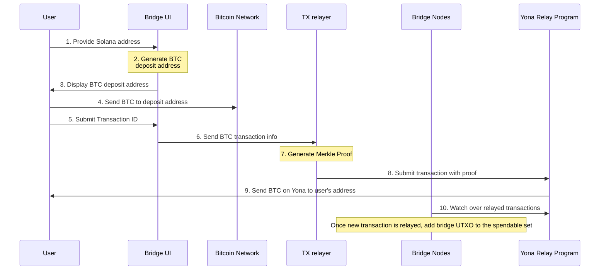

```mermaid
sequenceDiagram
    participant User
    participant Bridge UI
    participant Bitcoin Network
    participant TX relayer
    participant Bridge Nodes
    participant Yona Relay Program
    User ->> Bridge UI: 1. Provide Solana address
    Note over Bridge UI: 2. Generate BTC<br/>deposit address
    Bridge UI ->> User: 3. Display BTC deposit address
    User ->> Bitcoin Network: 4. Send BTC to deposit address
    User ->> Bridge UI: 5. Submit Transaction ID
    Bridge UI ->> TX relayer: 6. Send BTC transaction info
    Note over TX relayer: 7. Generate Merkle Proof
    TX relayer ->> Yona Relay Program: 8. Submit transaction with proof
    Yona Relay Program ->> User: 9. Send BTC on Yona to user's address
    Bridge Nodes ->> Yona Relay Program: 10. Watch over relayed transactions
    Note over Bridge Nodes: Once new transaction is relayed, add bridge UTXO to the spendable set
```