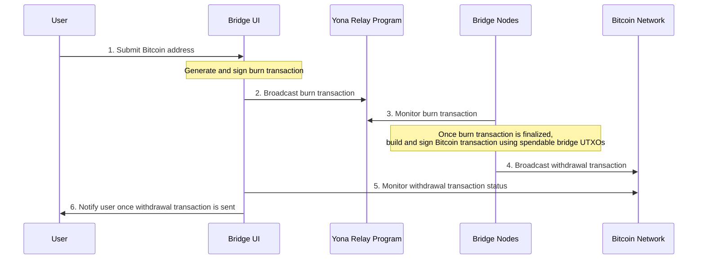

```mermaid
sequenceDiagram
    participant User
    participant Bridge UI
    participant Yona Relay Program
    participant Bridge Nodes
    participant Bitcoin Network
    User ->> Bridge UI: 1. Submit Bitcoin address
    Note over Bridge UI: Generate and sign burn transaction
    Bridge UI ->> Yona Relay Program: 2. Broadcast burn transaction
    Bridge Nodes ->> Yona Relay Program: 3. Monitor burn transaction
    Note over Bridge Nodes: Once burn transaction is finalized,<br> build and sign Bitcoin transaction using spendable bridge UTXOs
    Bridge Nodes ->> Bitcoin Network: 4. Broadcast withdrawal transaction
    Bridge UI ->> Bitcoin Network: 5. Monitor withdrawal transaction status
    Bridge UI ->> User: 6. Notify user once withdrawal transaction is sent
```