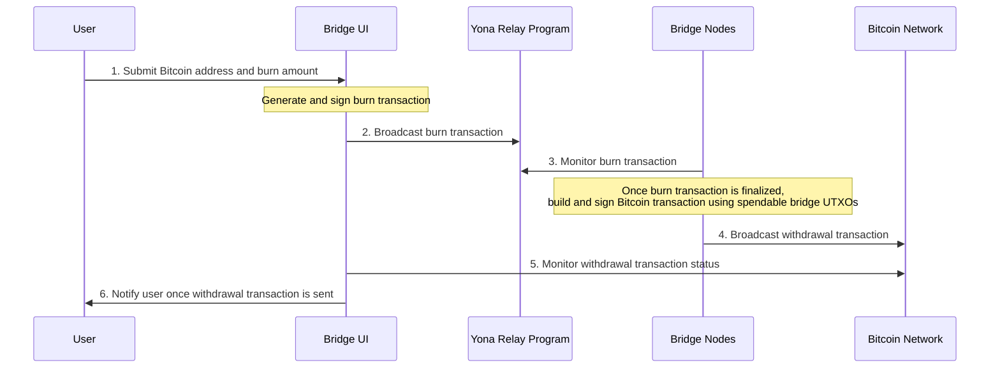

# Diagram description

1. The user submits a Bitcoin address and burn amount to the Bridge UI:
   The user initiates the withdrawal process by providing their Bitcoin address where they want to receive funds and
   specifying the amount of Yona BTC they want to "burn".
2. The Bridge UI broadcasts a burn transaction to the Yona Relay Program:
   Upon receiving the user's input, the Bridge UI generates and signs a burn transaction. This transaction effectively
   destroys the specified amount of Yona BTC, removing them from circulation. The signed transaction is then sent to
   the Yona Relay Program.
3. Bridge Nodes monitor the burn transaction:
   The Bridge Nodes, which are responsible for maintaining the integrity and security of the cross-chain bridge,
   actively monitor the Relay Program for the burn transaction. They verify the transaction's validity and wait for it
   to be finalized on the Yona blockchain.
4. Once the burn transaction is finalized, Bridge Nodes broadcast a withdrawal transaction to the Bitcoin Network:
   After the burn transaction is finalized, the Bridge Nodes construct a new transaction on the Bitcoin network, using
   the bridge's pool of Bitcoin UTXOs (Unspent Transaction Outputs). This transaction is designed to send the equivalent
   amount of Bitcoin to the user's specified address. The Bridge Nodes sign this transaction and broadcast it to the
   Bitcoin network.
5. The Bridge UI monitors the withdrawal transaction status:
   Once the withdrawal transaction is broadcast to the Bitcoin network, the Bridge UI begins monitoring its status. This
   involves checking for confirmations on the Bitcoin blockchain and tracking the transaction's progress.
6. The Bridge UI notifies the user once the withdrawal transaction is sent:
   After the withdrawal transaction has been successfully broadcast to the Bitcoin network and has received an initial
   confirmation, the Bridge UI sends a notification to the user. This notification typically includes details such as
   the transaction ID, the amount transferred, and any relevant fees. It informs the user that the cross-chain transfer
   process is complete from the bridge's perspective, though the user may need to wait for additional confirmations on
   the Bitcoin network before considering the transaction fully settled.
